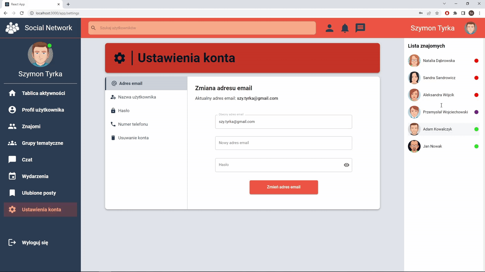

# Social Network App
A web application to operate a social networking site.  
*It was made as part of an engineering thesis.*

## Technologies
- ReactJS 17.0
- Redux 4.1
- Material UI 5.2
- Formik 2.2
- React Testing Library
- JavaScript
- HTML
- CSS

## Features
1. User account
    * registration
    * access authorization
    * change of account details
    * password reset
2. User profile
    * setting a profile photo
    * determining information, e.g. about interests, life events, education and profession
    * overview of the user's activities, friends, photos and groups
3. Posts and comments
    * publishing and managing a post
    * commenting and sharing
    * like a post or comment
4. Friends
    * sending invitations to friends
    * accepting or declining invitations
5. Chat
    * sending messages to friends
    * creating group conversations
6. Events
    * event creation and management
    * accepting or declining invitations
7. Thematic groups
    * creating or joining a group
    * group management by authorized members
    * discussion forum
    * analyzing the user's interests and proposing groups
8. Administrator panel
    * system content management by the administrator
    * viewing user reports
    
## Setup
To run the applications you must:
1. Clone the server repository:  
   [https://github.com/SzymonT99/social-network-server.git](https://github.com/SzymonT99/social-network-server.git)
2. Launch XAMPP Control Panel.
3. Run Spring Boot on the server.
4. Execute commands on the client
    * `npm install`
    * `npm start`

## Presentation
- Start views

  

- User activity view

  

- User profile

  

- Friends

  

- Chat

  

- Thematic groups

  

- Events

  

- Account settings

  